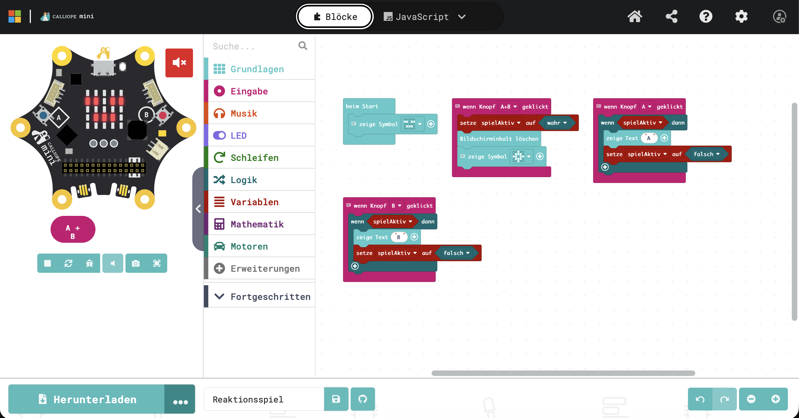

# 🎮 Reaktionsspiel mit dem Calliope mini

Ein einfaches Spiel für 2 Personen:  
Wer schneller drückt, gewinnt! 🏆

---

## 🔧 Materialien

- Calliope mini
- USB-Kabel
- Computer

👉 Einführung:  
https://makeyourschool.de/materialkoffer/calliope-mini/

---

## 🎯 Spielregeln

- Drückt **A + B gleichzeitig**, um das Spiel zu starten
- Das Symbol erscheint ⚡
- Jetzt schnell drücken:
  - Spieler 1 → Button A
  - Spieler 2 → Button B
- Wer zuerst drückt, gewinnt!

👉 Neustart: wieder **A + B drücken**

---

## 💻 Code (Blöcke)

---

## 🧠 Erklärung

- Das Spiel startet mit **A + B**
- Nur wenn das Spiel aktiv ist, kann man gewinnen
- Danach ist die Runde vorbei

---

## 🚀 Ideen

- Sound hinzufügen 🔊
- Punkte zählen
- Eigenes Gehäuse bauen
