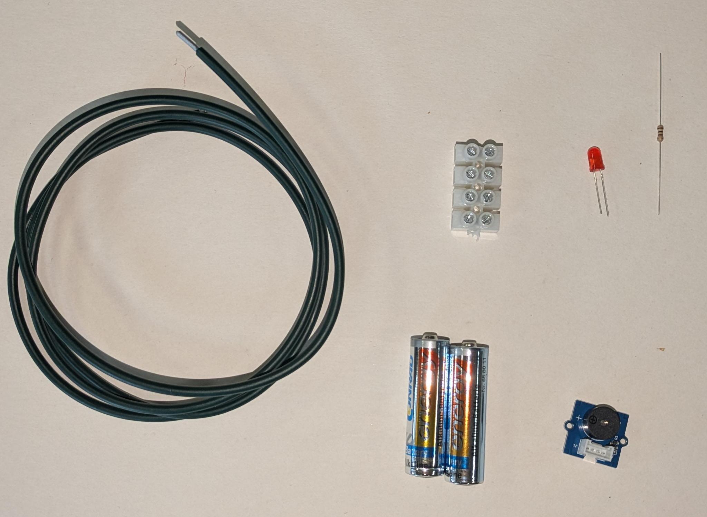
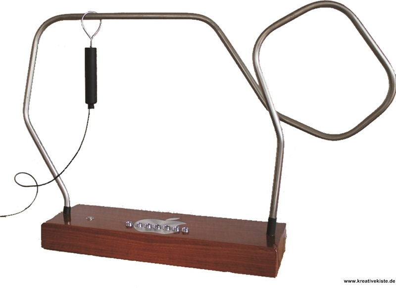

# Heißer Draht - Miniprojekt
## Projektbeschreibung
In diesem Miniprojekt wird ein einfacher Heißer Draht gebaut. Das Ziel des Spiels ist es, eine Metallschlaufe entlang eines gebogenen Drahtes zu führen, ohne ihn zu berühren. Sobald die Schlaufe den Draht berührt, wird ein Stromkreis geschlossen und ein Summer gibt ein akustisches Signal aus.

## Benötigte Materialien
* 2 Batterien 1,5V
* Passender Batteriehalter
* Summer
* langer Metalldraht für die Strecke
* Holz oder Pappe als Griff für die Schlaufe
* Grove Kabel, bei dem auf einer Seite der Stecker abgeschnitten ist
* Kabel zum Verbinden der Bauteile
* LED und passenden Vorwiderstand
* Lüsterklemme/Wagoklemme oder andere Verbinder

## Funktionsweise
Der Parcour besteht aus einem gebogenen Metalldraht. Eine bewegliche Schlaufe wird daran entlanggeführt.

Berührt die Schlaufe den Draht, entsteht ein geschlossener Stromkreis. Dadurch wird der Summer mit Strom versorgt und beginnt zu piepen. Solange keine Berührung stattfindet, bleibt der Stromkreis offen und der Summer bleibt aus.

## Aufbau

Quelle: https://www.kreativekiste.de/component/content/article?id=74:heissen-draht-bauen

Bastele aus Draht einen Parcour, welcher zu durchlaufen ist. Du kannst deiner Kreativität freien Lauf lassen. Löte ein Kabel an den Draht an.

Bastele dann einen Griff, an dem vorne eine Schlaufe befestigt ist. Hier muss ebenfalls ein Kabel angelötet werden.

Verbinde dann den Pluspol des Batteriehalters mit Kabel am heißen Draht-Parcour und das Kabel der Schlaufe mit dem Vin-Pin (Rot) und dem Signal-Pin (Gelb) des Summers. Du Kannst dafür eine Lüsterklemme oder Wagoklemme nutzen.

Verbinde dann den Minuspol des Batteriehalters mit dem GND-Pin (Schwarz) des Summers.

Suche dir dann einen passenden Vorwiderstand für die LED und verbinde ihn mit der Anode (langes Beinchen) der LED. Dann verbindest du den Vorwiderstand mit dem Pluspol des Batteriehalters. Anschließend verbindest du die Kathode (kurzes Beinchen) der LED mit dem Minuspol des Batteriehalters.

Lege dann die Batterien in den Batteriehalter ein und schon bist du fertig!

Wenn die Schlaufe den Draht berührt, wird der Stromkreis geschlossen und der Summer ertönt.

Du kannst natürlich jederzeit die Schwierigkeit deines Parcours erhöhen, indem du den heißen Draht anders formst.
